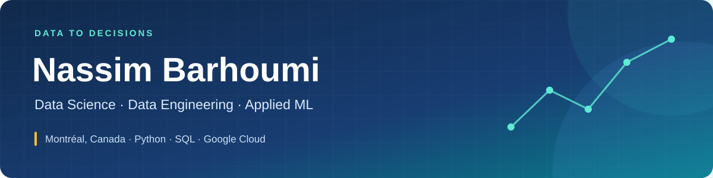

  <strong>Junior Data Scientist @ Tennis Canada · Computer Science @ Université de Montréal</strong>

  
  
  

I build **data pipelines, analytics tools, and ML applications** that turn raw data into practical decisions. My experience spans production systems at Tennis Canada, computer vision at ManipAI, and NLP projects at Mila hackathons.

Currently completing my **B.Sc. in Computer Science** at Université de Montréal (expected December 2027). Fluent in French and English.

## ⚡ Experience & impact

| 🎾 Match records | ☁️ Production pipelines | 📊 Reporting model |
| :---: | :---: | :---: |
| **488K → 2.6M** | **2 deployed** | **170+ DAX measures** |
| Historical data recovery | ITF & WTA → BigQuery | National Bank Open |

At Tennis Canada, my work spans API ingestion, cloud pipelines, data modeling, and business intelligence:

- **Data completeness:** Fixed pagination defects in a WTA ingestion pipeline and ran historical backfills, expanding the match-results table from approximately **488,000 to 2.6 million rows**.
- **Production pipelines:** Built and deployed **two pipelines** ingesting ITF and WTA match data into BigQuery using Python, dlt, Cloud Run, and Cloud Scheduler.
- **Analytics and reporting:** Developed a Power BI reporting model for the National Bank Open covering **68 key pages and 170+ DAX measures**.
- **Business decisions:** Combined web analytics, ticket sales, and spectator survey data to communicate audience and tournament insights to marketing stakeholders.

## 🔎 Selected projects

### [Demenago Vision — Computer vision for moving estimates](https://github.com/nass1379/demenago_public)

At ManipAI through Experience Ventures, I developed a **YOLOv8 pipeline** to detect moving-related objects and deployed a **Streamlit application** integrating inference and truck-size recommendations.

The prototype estimates moving volume from photos using object detection and geometric assumptions. Estimates are indicative and intended for demonstration.

**Technologies:** Python, YOLOv8, Streamlit  
[Public project documentation](https://github.com/nass1379/demenago_public#readme) · [English overview](https://github.com/nass1379/demenago_public/blob/main/README_ENGLISH.md)

### [AIMS Hackathon — NLP for compliance documents](https://github.com/nass1379/aims)

At the Mila AIMS Hackathon, I fine-tuned a Transformer model for compliance-report classification and designed an interface to communicate model explanations to non-technical users. The project received a **special mention**.

The public documentation outlines a workflow for classifying modern slavery-related content, from data preparation through evaluation.

**Focus:** NLP, model fine-tuning, explainability  
[Project documentation](https://github.com/nass1379/aims#readme) · [Video demonstration](https://youtu.be/lquIqSGoNYA)

## 🧰 Technical toolkit

**Data & cloud**

    

REST APIs · dlt · ETL/ELT · Cloud Run · Cloud Scheduler · PostgreSQL · DAX · GA4

**Machine learning & development**

    

YOLOv8 · LoRA fine-tuning · Computer vision · NLP · Jupyter

---

## 🤝 Connect

I'm interested in opportunities across data science, data engineering, ML engineering, and analytics where I can build useful systems and measure their impact.

[Contact me on LinkedIn](https://www.linkedin.com/in/nassim-barhoumi/).
