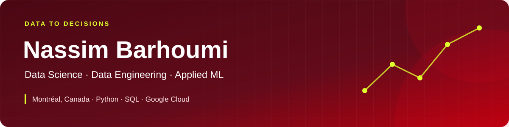

  <strong>Junior Data Scientist @ Tennis Canada · Computer Science @ Université de Montréal</strong>

  
  
  

Building data pipelines and analytics tools for tennis and business operations. Interested in applied machine learning and sports analytics.

## Selected projects

- **[Demenago Vision](https://github.com/nass1379/demenago_public)** — A computer vision prototype that estimates moving volume from photos using YOLOv8 and Streamlit.
- **[AIMS Hackathon](https://github.com/nass1379/aims)** — NLP for compliance-document classification and explainability; awarded a special mention.
- **[Player Data — IFT3150](https://github.com/nass1379/ift3150-player-data)** — An ongoing university project on tennis player data, in collaboration with Tennis Canada.

## Core technologies

     

## Education

B.Sc. in Computer Science · Université de Montréal · Expected December 2027  
International Baccalaureate (IB) Diploma
